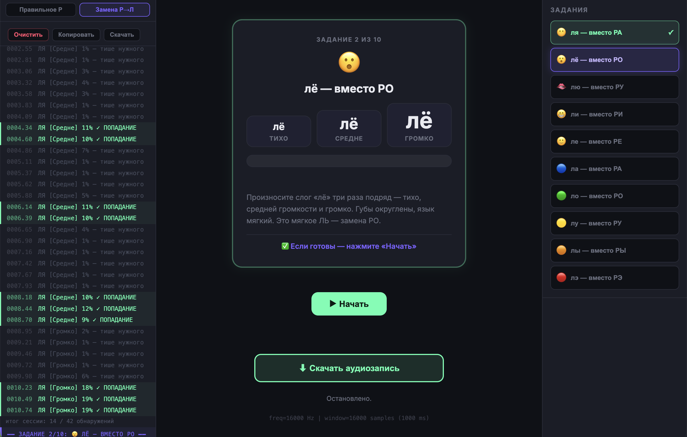

# R-phoneme 🔷 v6.0

> Инструмент для сбора данных и дообучения нейросети распознавания звука «Р»
> в детской речи — приложение для исследователей и разработчиков логопедических ИИ.

**[▶ Открыть в браузере](https://lexbayart.github.io/r-phoneme/)** — v6.0: профили пользователей, история прогресса, режим «Замена Р→Л»
Без установки. Без аккаунта. Работает офлайн.

---

## 🔷 Для чего это нужно

Нейросеть обучили определять, произносит ли ребёнок звук «Р» правильно.
Но любая модель имеет слепые зоны: какие-то варианты произношения она ловит,
а какие-то пропускает или путает со шумом. Как найти эти слабые места?

**R-phoneme — это инструмент для тестирования и дообучения нейросети.**

Приложение прогоняет речь через модель в реальном времени и фиксирует каждое
решение: что модель «подумала», с какой уверенностью, где ошиблась, где пропустила.
На основе этих данных модель переобучается — и становится точнее.

Это инструмент для исследователя и разработчика, который хочет понять,
где нейросеть слаба, и собрать данные для её улучшения.

### Как это работает

1. Человек произносит звук «Р» в разных вариантах — приложение предлагает структурированные задания-карточки
2. Нейросеть (Edge Impulse, WASM) классифицирует каждый фрагмент: «Р» / шум / неизвестно
3. Каждое решение фиксируется в логе с временной меткой, уверенностью и амплитудой
4. Параллельно записывается аудиодорожка WAV — синхронизированная с логом по времени
5. Лог и аудио скачиваются, анализируются: где модель ошиблась → примеры добавляются в датасет → модель переобучается

### Структурированные задания для сбора данных

Вместо хаотичного «просто поговорите» приложение предлагает **карточки с заданиями**,
покрывающие все сценарии, в которых нейросеть может ошибаться:

**Набор «Правильное Р»** — 6 режимов произношения:
- Раздельное «р» · «р» · «р» — изолированные звуки с паузами
- Непрерывное «р-р-р-р-р» — длинный артикуляционный ряд
- Порциями «р-р-р · р-р-р» — короткие серии с вдохами
- Нарастание — от шёпота до максимальной громкости
- Высокий тон — «Р» в тонком / детском голосе
- Низкий тон — «Р» в грудном / басовом регистре

Каждое задание автоматически прогоняет все пресеты настроек (3 секунды на пресет),
чтобы собрать данные для разных конфигураций модели за одну сессию.

**Набор «Замена Р→Л»** — 10 карточек замены (мягкое ЛЬ и твёрдое Л):
- Мягкие: ля, лё, лю, ли, ле — вместо РА, РО, РУ, РИ, РЕ
- Твёрдые: ла, ло, лу, лы, лэ — вместо РА, РО, РУ, РЫ, РЭ
- Каждое задание отрабатывает три уровня громкости: тихо → средне → громко

Это позволяет собрать данные о том, как модель реагирует на звуки,
которые ребёнок-логопат произносит ВМЕСТО «Р» — и научиться их отличать.

### Почему это нужно именно так

- **Объективный аудит модели:** вместо «мне кажется, она плохо слышит» — конкретные цифры: r=42% при пороге 60%, пропуск в 18 из 30 случаев
- **Синхронизированные данные:** лог и WAV-запись привязаны к одному таймкоду — можно точно сопоставить, что было сказано и как модель отреагировала
- **Точечное дообучение:** видно, в каких именно режимах (тихий, высокий тон, раздельное) модель работает хуже → собираем примеры → переобучаем
- **Настраиваемые пресеты:** 4 конфигурации для проверки модели в разных условиях
- **Экспорт:** лог (.txt) и аудиозапись (.wav) скачиваются одной кнопкой

---

## ✨ Возможности

- 👤 **Профили пользователей** — несколько детей, прогресс каждого сохраняется в браузере (localStorage)
- 🎤 **Захват речи в реальном времени** — через микрофон браузера, без сервера
- 🧠 **Нейросеть Edge Impulse (WASM)** — классификация «Р» / шум / неизвестно прямо в браузере
- 🃏 **Карточки с заданиями** — структурированные сценарии для полного покрытия вариантов произношения
- 📊 **Визуализация уверенности** — цветные полосы для каждого класса с процентами
- 📈 **Уровень микрофона** — полоса громкости в реальном времени
- 🎚️ **Живые слайдеры** — порог, масштаб, интервал, нормализация — всё меняется на лету
- ⚙️ **4 пресета** — готовые конфигурации для тестирования модели в разных условиях
- 🔄 **Автоцикл пресетов** — при записи пресеты переключаются автоматически каждые 3 секунды
- 📋 **Лог с временными метками** — каждая итерация с данными; копирование и скачивание .txt
- 🎙️ **Запись аудио WAV** — 16-bit PCM, 16 kHz; синхронизирована с логом по таймкоду
- 📥 **Скачивание** — лог (.txt) и аудиозапись (.wav) одной кнопкой
- 🔀 **Два набора заданий** — «Правильное Р» (6 режимов) и «Замена Р→Л» (10 карточек с уровнями громкости)
- 🧭 **Навигация по карточкам** — в наборе Л: список всех заданий с отметками выполненных

---

## 🚀 Открыть

**[▶ lexbayart.github.io/r-phoneme](https://lexbayart.github.io/r-phoneme/)**

Приложение работает полностью в браузере. Ничего устанавливать не нужно.
Модель нейросети загружается вместе со страницей.

Можно также скачать `index.html` и файлы модели из этого репозитория и запустить локально:
```bash
python3 -m http.server 8082
# открыть http://localhost:8082
```

---

## 📖 Документация

- [**Полное руководство пользователя**](docs/GUIDE.md) — режимы, задания, пресеты, настройки, лог, экспорт

---

## 🛠️ Технологии

Edge Impulse (WASM) · Web Audio API · ScriptProcessorNode · Vanilla JS · HTML5
Три файла · Ноль зависимостей · Ноль шагов сборки

---

## 💬 Обратная связь

Проект в активной разработке.
Нашли ошибку или есть идея? Пишите:

- **Telegram:** [@lexbay](https://t.me/lexbay)
- **GitHub Issues:** [Открыть issue](https://github.com/lexbayart/r-phoneme/issues)

---

## 📋 История версий

- **v6.0** (2026-06-30) — профили пользователей, сохранение прогресса, экран выбора профиля
- **v5.x** (2026-06-27) — набор «Замена Р→Л», навигация по карточкам, конфетти, оптимизации
- **v4.x** (2026-06-27) — карточки с заданиями, автоцикл пресетов, слайд-переходы
- **v3.x** (2026-06-26) — отладочная панель, пресеты, лог, запись WAV
- **v1.0** (2026-06-24) — первый рабочий прототип

---

## 📄 Лицензия

© 2025 lexbayart — [CC BY-NC 4.0](https://creativecommons.org/licenses/by-nc/4.0/)

Бесплатно для использования и распространения в некоммерческих целях с указанием автора.
Коммерческое использование требует явного разрешения автора.

*Last updated: 2026-06-30*
